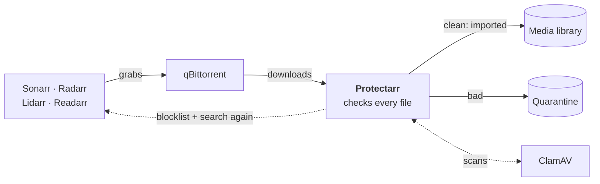
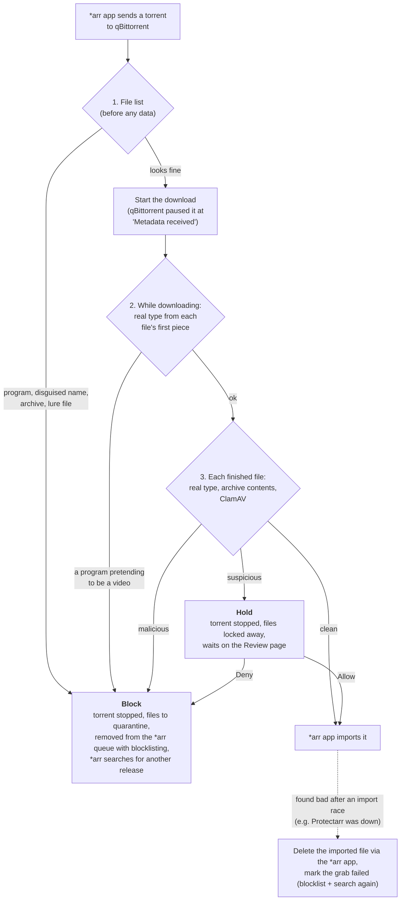
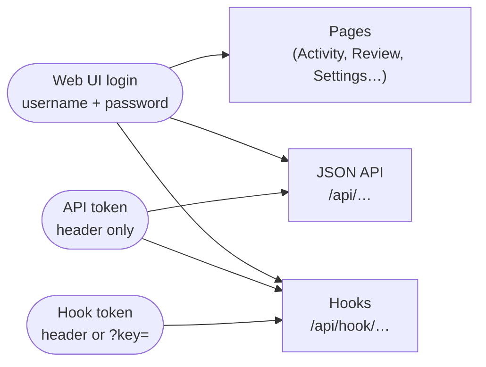

# How Protectarr fits into your stack

GitHub draws the diagrams below. The README covers setup; [`design.md`](design.md) explains why it's built this way.

## The stack

Protectarr is one container beside the ones you already run. qBittorrent downloads and the *arr apps import as usual; Protectarr watches them through their APIs and steps in only when a file is bad. The table below lists every connection it uses.

| Connection | What Protectarr uses it for |
|---|---|
| qBittorrent Web API | New torrents and their file lists (polled every few seconds), stopping, starting and removing torrents, asking for each file's first and last pieces early |
| qBittorrent hooks (optional) | An instant nudge when a torrent is added or finishes, instead of waiting for the next poll |
| Downloads folder | Reading each file's first bytes for its real type, listing archives, moving bad files to quarantine. Mounted at the same path as in qBittorrent |
| ClamAV (clamd over TCP) | Signature scans. Files are streamed to it, so ClamAV doesn't need the downloads folder |
| *arr APIs | Which categories to watch, removing a bad release from the queue with blocklisting on (the app then searches for another), deleting a bad file that was already imported |
| Prowlarr API (optional) | Indexer names and links for the Indexers page |

## What happens to a download

Anything Protectarr can't check counts as suspicious, not clean: files it can't find or read, or ClamAV being down. Downloads held only because ClamAV was down are scanned again once it's back.

## Who can open what

The hook token lives in qBittorrent's settings and can end up in its logs, so it opens nothing but the hooks. The API token can change settings, so it's only accepted as a header (never in a URL). Neither opens the web pages.
